# Интернет-магазин

## Общие требования
1. Использование фреймворка (Laravel)
2. Использование composer
3. Работа с БД через PDO (SQLite)
4. Регистрация и авторизация
5. Публичная часть и админка
6. ACL - разграничение прав доступа
7. Оформление кода по PSR-1/12

## Требования к магазину
1. Регистрация и авторизация
2. Форма регистрации включает адрес
3. Реализован каталог товаров (с разделением по категориям и брендам)
4. Возможность добавить товар в корзину (счет товаров в корзине)
5. Реализована возможность оформления заказов
6. Просмотр истории заказов
7. Личный кабинет для покупателя и продавца со списком заказов в разных статусах (Новый, Оплачен, Собирается, Передан на доставку, Выполнен)
8. Админка с возможностью управлять ролями пользователей и заказами
9. При оформлении заказа - отправка email покупателю и продавцу

## Технические решения
* Использование composer
* PHP 7.4.30
* Laravel 7
* Bootstrap
* SQLite

## Внешний вид

### Авторизация
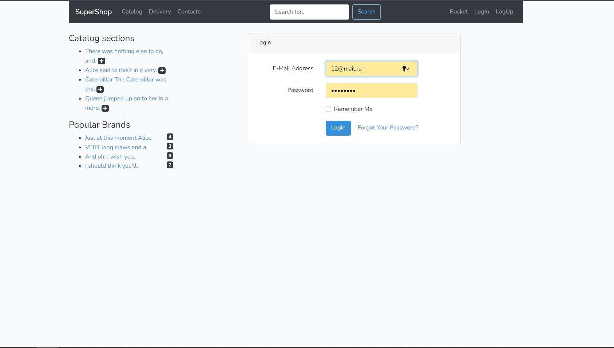

### Регистрация
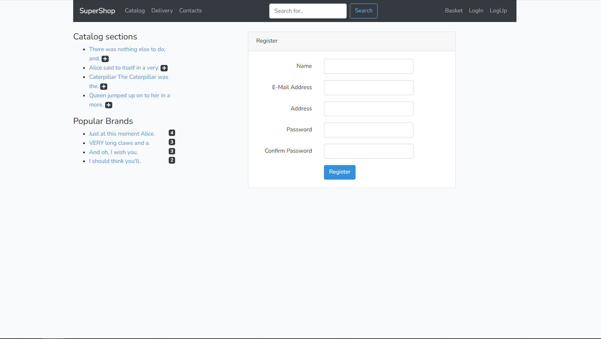

### Главная страница
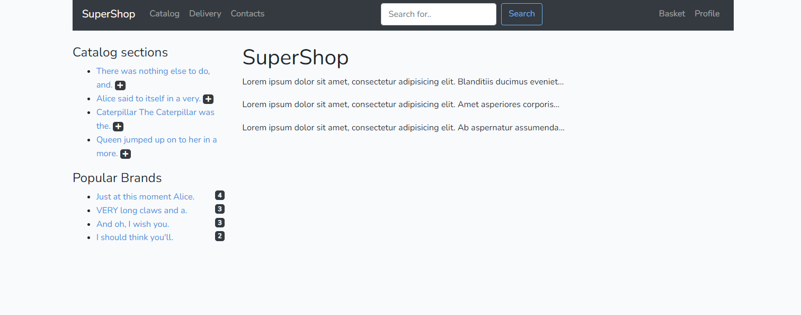

### Каталог товаров
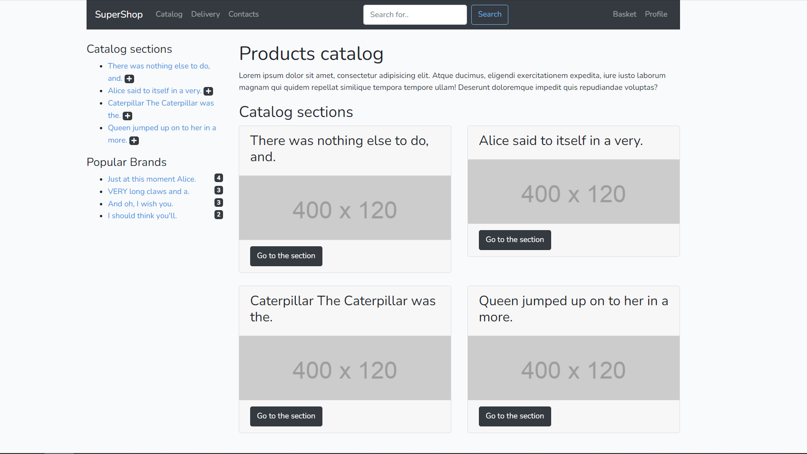

### Каталог брендов
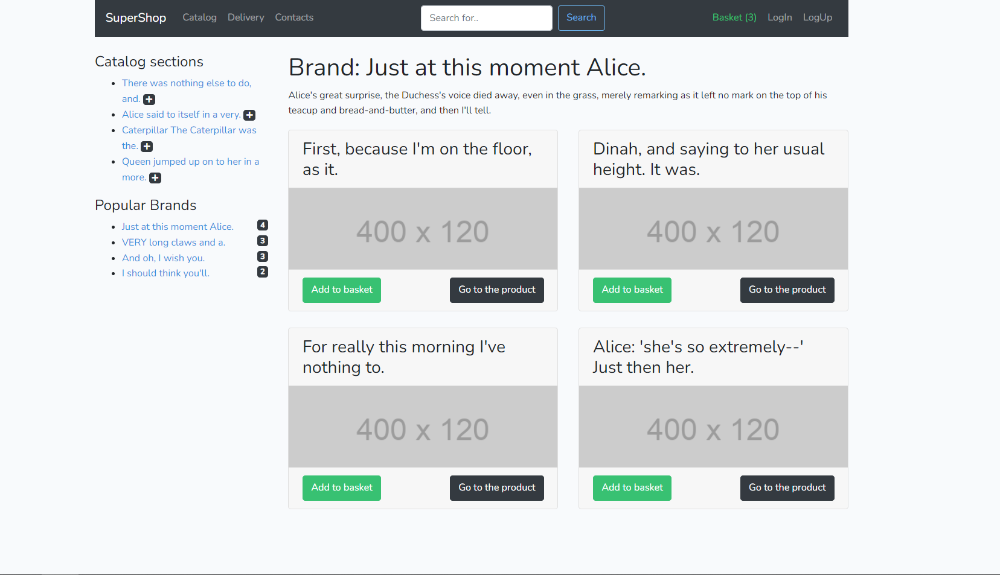

### Страница товара
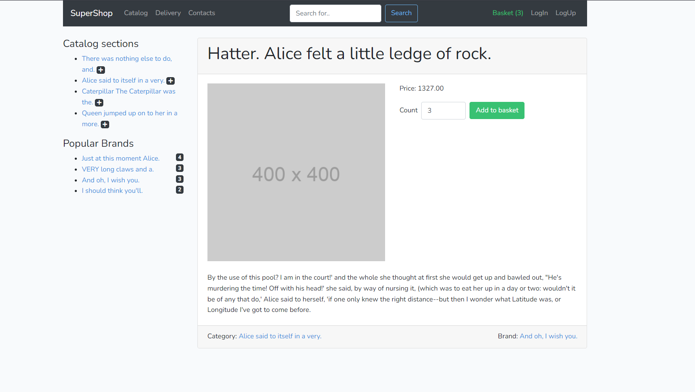

### Корзина
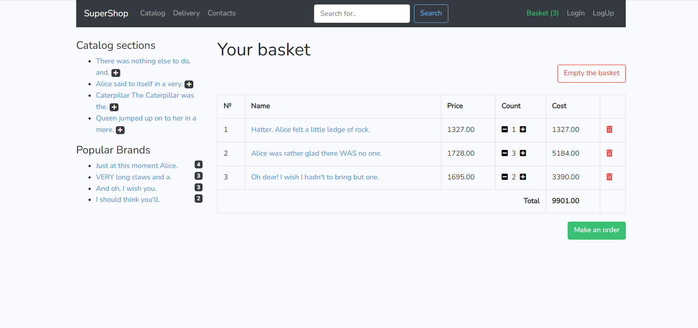

### Корзина пустая 
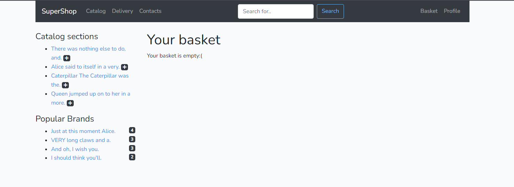

### Оформление заказа
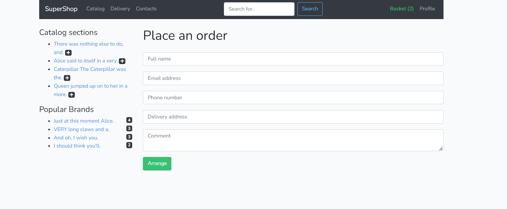

### Заказ оформлен
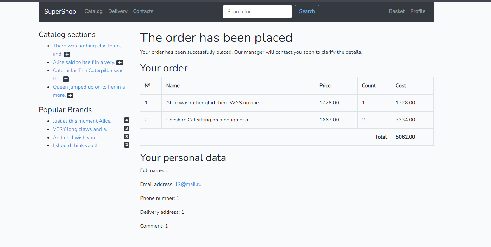

### Личный кабинет
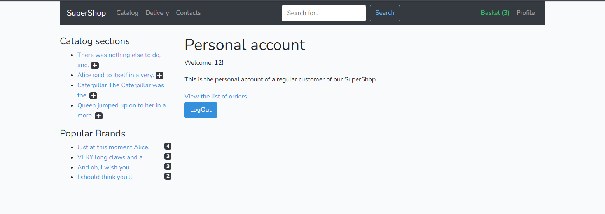

### Список личных заказов
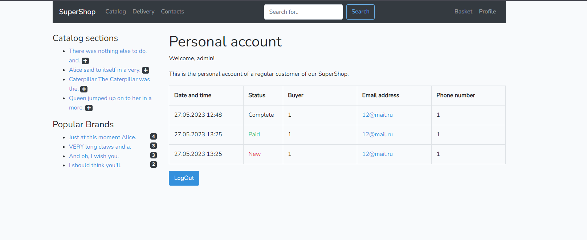

### Панель админа
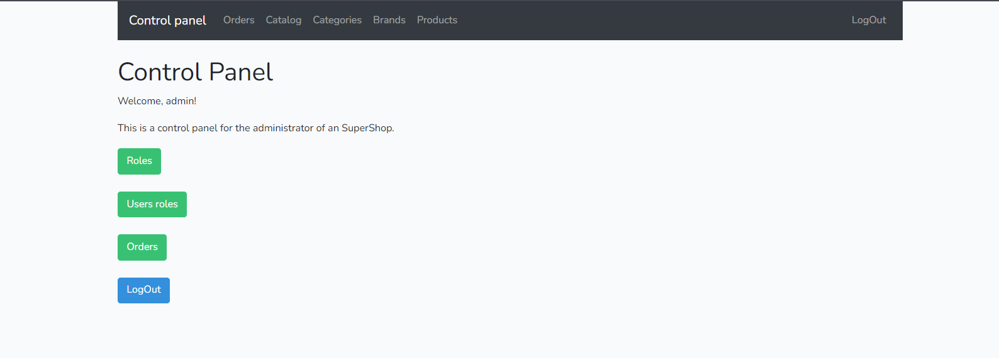

### Список всех заказов (админ)
.png)

### Просмотр заказа (админ)
.png)

### Редактирование заказа (админ)
.png)

### Статус заказа отредактирован (админ)
.png)

### Список ролей (админ)
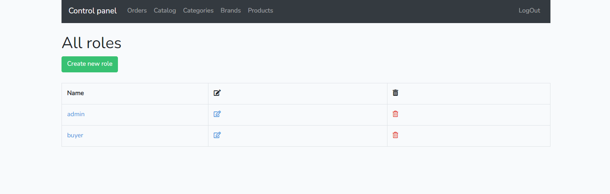

### Создание новой роли (админ)
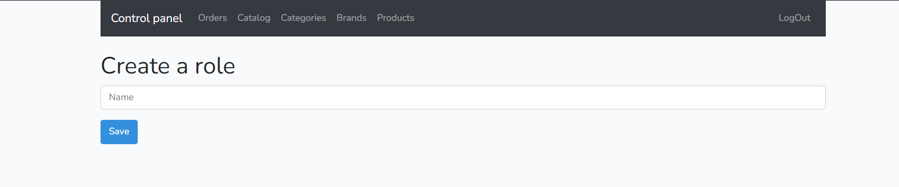

### Список пользователей с ролями (админ)
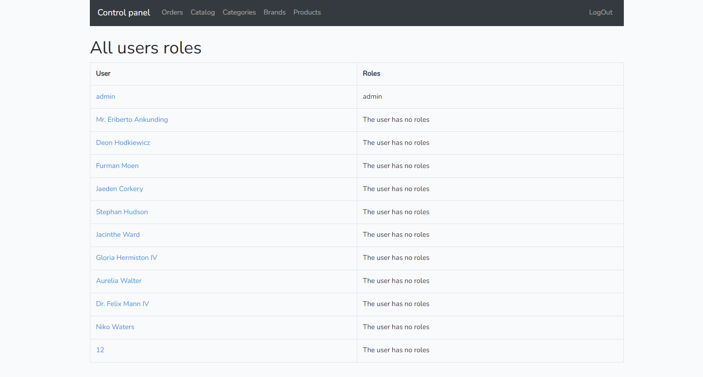
